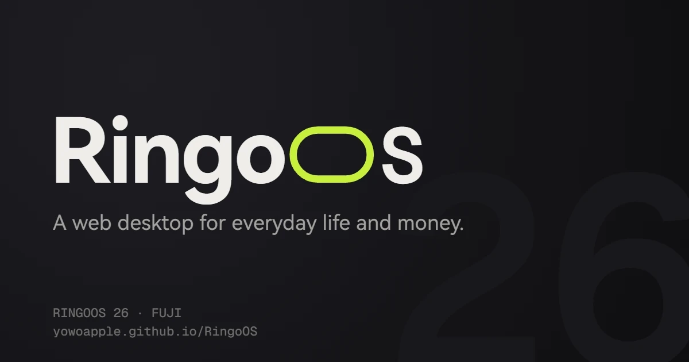
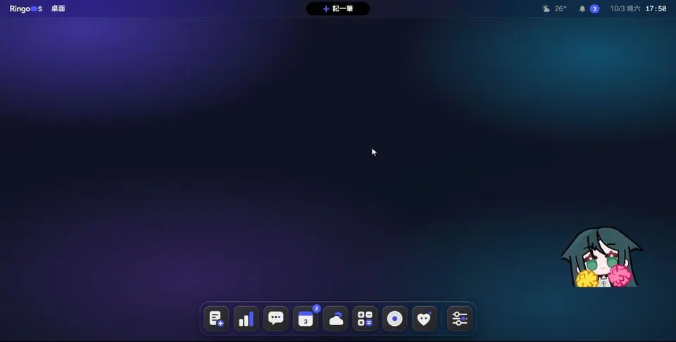
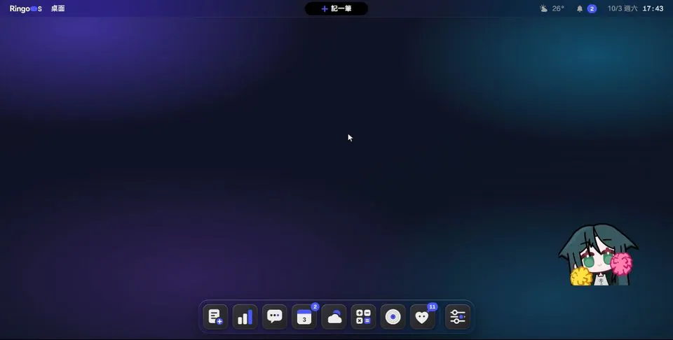
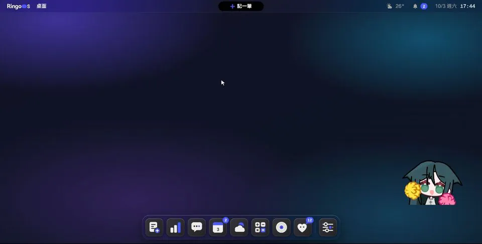
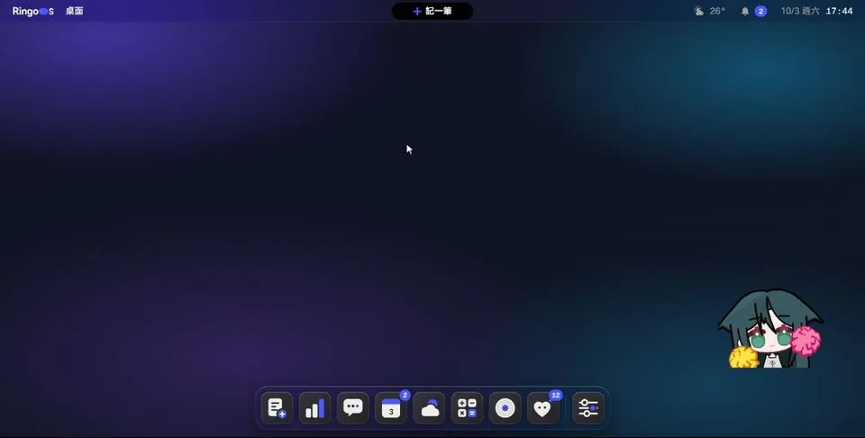
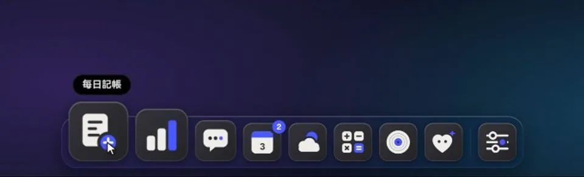

<p align="center">
  
</p>

<p align="center">
  <b>Your money, your day, your little companion — on one calm, fluid desktop.</b><br>
  A ledger, budgets, reminders, a calendar, weather, a radio and a desktop pet,<br>
  living together in an operating system that runs entirely in your browser.
</p>

<p align="center">
  <a href="https://yowoapple.github.io/RingoOS/"><b>Open RingoOS</b></a>
  &nbsp;·&nbsp; <a href="#highlights">Highlights</a>
  &nbsp;·&nbsp; <a href="#design-notes">Design notes</a>
  &nbsp;·&nbsp; <a href="#under-the-hood">Under the hood</a>
  &nbsp;·&nbsp; <a href="#credits">Credits</a>
</p>

<p align="center">
  
  
  
  
</p>

<br>

<p align="center">
  
</p>

## Meet RingoOS

Most money apps feel like spreadsheets. Most desktops in a browser feel like toys.
RingoOS is neither.

It is a complete desktop — windows, a Dock, a menu bar, a Dynamic Island — built
around the small, daily habit of keeping track of your life. Log a coffee in two
seconds from the island. Watch this month's spending curve bend toward your budget.
Let the weather tint your window. Say hi to SAYA, who lives on your desktop, gets
hungry when you forget to log, and remembers every streak you keep.

Everything happens on your device. No account, no server, no tracking. Close the
tab, come back tomorrow, and your desktop is exactly where you left it — even offline.

<br>

## Highlights

<table>
  <tr>
    <td width="50%" valign="top">
      
      <h3>Motion you can interrupt</h3>
      Every animation is a living spring, not a timeline. Click again halfway
      through and the window turns around from exactly where it is — no jumps,
      no waiting for the animation to finish.
    </td>
    <td width="50%" valign="top">
      
      <h3>Windows with weight</h3>
      Throw a window and it glides with real momentum. Pull it to an edge and a
      snap zone appears. Release, and it settles in with a soft overshoot.
    </td>
  </tr>
  <tr>
    <td width="50%" valign="top">
      
      <h3>The Dynamic Island, for your wallet</h3>
      Tap the island, type an amount, pick a category. It morphs open, confirms
      with a drawn checkmark and a rolling number, and folds itself away.
    </td>
    <td width="50%" valign="top">
      
      <h3>A ledger that answers back</h3>
      Search across every month with plain words or <code>&gt;500</code>. Results
      group themselves by month, totals update live, and any record can be edited
      in place.
    </td>
  </tr>
  <tr>
    <td width="50%" valign="top">
      
      <h3>See where the month is heading</h3>
      A cumulative spending curve against your budget, a category ring that pushes
      a slice forward when you touch it, and a six-month trend — all morphing
      smoothly whenever the data changes.
    </td>
    <td width="50%" valign="top">
      
      <h3>Weather you can feel</h3>
      Rain slants with the wind and splashes on the cards. Snow settles on their
      edges. On a hot day there is no cartoon sun — the temperature itself glows.
      Live forecasts worldwide, with official station data in Taiwan.
    </td>
  </tr>
  <tr>
    <td width="50%" valign="top">
      
      <h3>A companion, not a mascot</h3>
      Logging feeds her. Streaks make her trust you. She reacts to budgets, tasks
      and music, collects every pose she has ever shown you, and celebrates
      holidays and your birthday.
    </td>
    <td width="50%" valign="top">
      
      <h3>Every pixel is considered</h3>
      Concentric corners, glass that adapts its thickness to your wallpaper,
      an accent color picked from your photo, and soft synthesized sound — off
      until you ask for it.
    </td>
  </tr>
</table>

<br>

## Design notes

**Soft, but never vague.** RingoOS moves like HyperOS and lands like iOS: springs
with real mass and a gentle overshoot, tuned per gesture. Shapes stretch toward
where they are going and squash when they arrive. Nothing simply fades in.

**Typography first.** Big numbers, monospaced figures that roll digit by digit,
headlines that break on words instead of characters. When there is something to
say, the type says it.

**Color only when something happens.** The interface is ink and paper. One accent
color — chosen to match your wallpaper — appears for selection, focus, today,
and anything that needs your attention.

**Effects that respect the layout.** Weather, glows and particles measure the
content and stay behind it. The title bar stays clean. Three strength levels
change which details appear, not just how many.

**Comfortable by default.** The interface is designed at a 130% base scale for
readability on small, dense screens, and every animation has a reduced-motion
path.

<br>

## Under the hood

RingoOS is written in plain JavaScript modules — no UI framework, no animation
library, no runtime dependencies beyond a QR encoder and a font. The interesting
parts:

- **Spring physics engine.** Motions are specified with Apple-style `response` and
  `dampingFraction`, converted to stiffness and friction and integrated at a fixed
  1/240 s step (dt clamped to 64 ms). A single `requestAnimationFrame` scheduler
  drives every motion, with a re-entrancy guard so motions can start other motions
  from inside an update without spawning extra loops. Retargeting preserves
  velocity, which is what makes every animation interruptible.
- **Window manager.** Windows morph out of their Dock icons using transforms plus
  a rounded `clip-path` inset, so the corner radius stays true at every scale.
  Dragging feeds a velocity tracker; release projects a glide distance from the
  spring's response. Includes edge snapping with live previews, eight-way resize,
  rubber-banding, a phone layout and session restore.
- **Interruptible in-window motion.** Complex transitions such as the ledger
  search bar are state machines (`closed → opening → open → closing`) over shared
  springs; `open()` and `close()` only change targets, and irreversible layout
  swaps happen only once a spring has truly settled.
- **Storage.** A key-value layer over IndexedDB with an in-memory cache,
  microtask-batched writes and flush on `pagehide`. Tabs stay in sync through
  `BroadcastChannel`. Data is versioned with tested migrations (schema 3), and
  recurring expenses post exactly once per month, guarded by the Web Locks API.
- **Adaptive glass.** `backdrop-filter` runs in three tiers chosen from device
  capabilities and live frame-time sampling, with automatic downgrades. Menu-bar
  and Dock glass thickness is computed from the wallpaper's luminance to keep text
  contrast above 4.5 : 1. SVG displacement refraction is reserved for small lenses.
- **Weather effects.** A canvas layer under the content draws rain, storms, snow,
  stars, clouds and fog. It measures the layout, subtracts a blurred mask of the
  text and cards each frame, and pauses whenever the window is hidden, minimized
  or fully covered.
- **Sound.** Eighteen voices synthesized live with Web Audio — oscillators,
  filtered noise and envelopes through a compressor — panned by window position
  and ducked while the radio plays. No audio files.
- **Offline.** A service worker generated at build time precaches the app shell
  by content hash, serves navigations network-first and character art on demand,
  and offers an in-app update when a new version ships.
- **Tested cores.** Calculations, migrations, search, insights, achievements,
  weather mapping and more live in pure modules covered by 240 Vitest tests.

| | |
|---|---|
| Language | JavaScript (ES modules), HTML, CSS |
| Build | Vite |
| Tests | Vitest |
| Storage | IndexedDB, BroadcastChannel, Web Locks |
| Graphics | CSS transforms and `clip-path`, Canvas 2D, SVG |
| Audio | Web Audio API |
| Data | Open-Meteo, Taiwan Central Weather Administration, Photon (OpenStreetMap), GeoNames |

<br>

## Getting started

```bash
npm ci
npm run dev       # http://localhost:5178
npm test
npm run build     # outputs to dist/
npm run preview   # http://localhost:5179
```

Requires Node.js 22.12 or newer. Pushing to `main` deploys to GitHub Pages
through the included workflow.

## Privacy

Everything you enter stays in your browser's storage. RingoOS has no backend and
no analytics. The only network requests are weather and place lookups, YouTube
playback when you use the radio's YouTube mode, and the optional Taiwan CWA
weather API with a key you provide, which is stored only on your device.

## Credits

- Companion animations made with [EmoteLab](https://emotelab.app). The character
  design belongs to its original creator.
- Weather data by [Open-Meteo](https://open-meteo.com) (CC BY 4.0) and the
  [Central Weather Administration, Taiwan](https://opendata.cwa.gov.tw).
- Place search by [Photon](https://photon.komoot.io), © OpenStreetMap contributors
  (ODbL), and [GeoNames](https://www.geonames.org) (CC BY 4.0).
- The radio's YouTube mode uses YouTube API Services —
  [YouTube Terms of Service](https://www.youtube.com/t/terms) ·
  [Google Privacy Policy](https://policies.google.com/privacy).
- Typefaces: HarmonyOS Sans (HarmonyOS Sans Fonts License) and
  [Geist Mono](https://github.com/vercel/geist-font) (SIL OFL 1.1).
- QR codes by [qrcode-generator](https://github.com/kazuhikoarase/qrcode-generator) (MIT).

Full notices are in [THIRD_PARTY_NOTICES.md](THIRD_PARTY_NOTICES.md).

## License

Copyright © 2026 YoWoRingo. All rights reserved. You are welcome to read the
source to learn from it; see [LICENSE](LICENSE) for what is and isn't permitted.

<p align="center"><sub>Designed and built by <a href="https://yowoapple.github.io/YoWoRingo/">YoWoRingo</a>.</sub></p>
